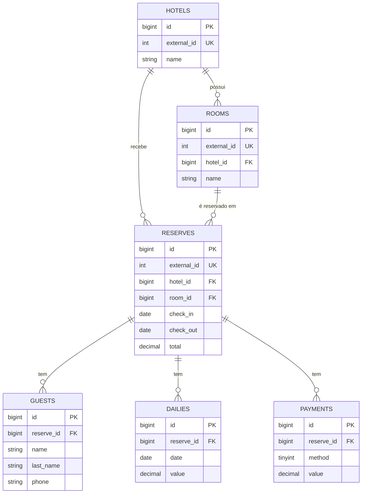

# Modelagem do banco de dados

```mermaid
erDiagram
    HOTELS ||--o{ ROOMS : possui
    HOTELS ||--o{ RESERVES : recebe
    ROOMS ||--o{ RESERVES : "é reservado em"
    RESERVES ||--o{ GUESTS : tem
    RESERVES ||--o{ DAILIES : tem
    RESERVES ||--o{ PAYMENTS : tem

    HOTELS {
        bigint id PK
        int external_id UK
        string name
    }
    ROOMS {
        bigint id PK
        int external_id UK
        bigint hotel_id FK
        string name
    }
    RESERVES {
        bigint id PK
        int external_id UK
        bigint hotel_id FK
        bigint room_id FK
        date check_in
        date check_out
        decimal total
    }
    GUESTS {
        bigint id PK
        bigint reserve_id FK
        string name
        string last_name
        string phone
    }
    DAILIES {
        bigint id PK
        bigint reserve_id FK
        date date
        decimal value
    }
    PAYMENTS {
        bigint id PK
        bigint reserve_id FK
        tinyint method
        decimal value
    }
```